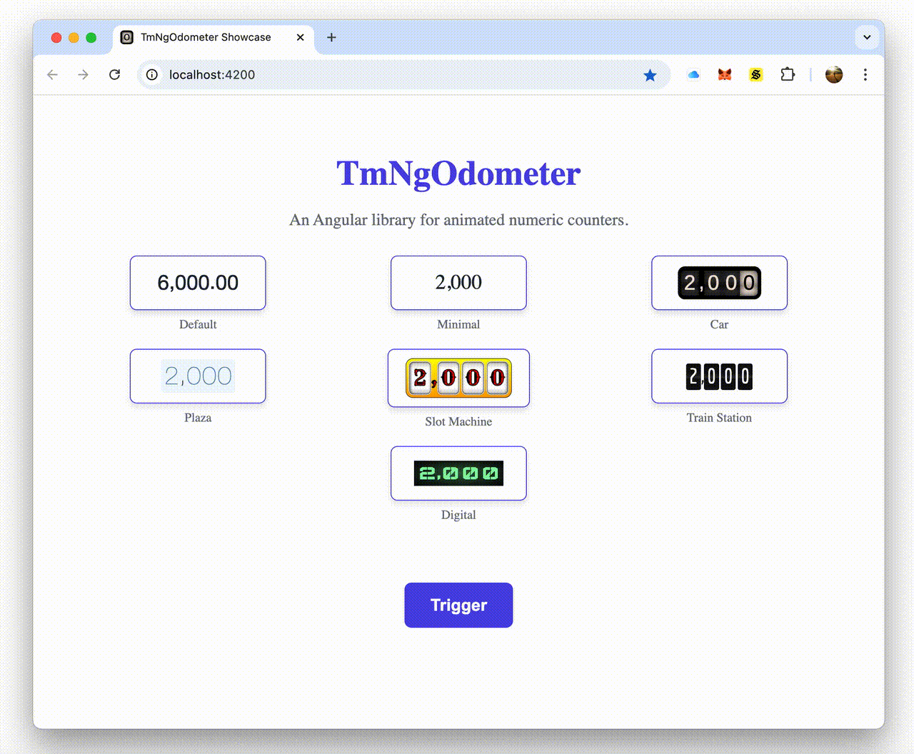
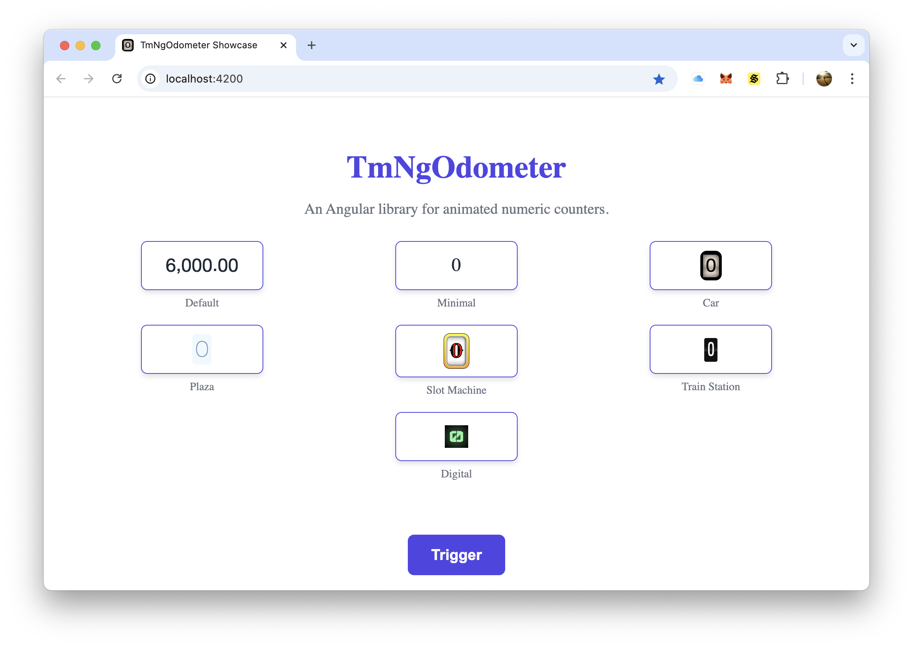

# TmNgOdometer [](https://www.npmjs.com/package/tm-ng-odometer) [](http://opensource.org/licenses/MIT)

**TmNgOdometer** is an Angular library for creating animated numeric counters with precise decimal handling and support for various themes and animation styles.

## Table of Contents

1. [Project Overview](#project-overview)
2. [Features](#features)
3. [Screenshots](#screenshots)
4. [Environment Setup](#environment-setup)
   - [Prerequisites](#prerequisites)
   - [Setup Steps](#setup-steps)
5. [Usage](#usage)
   - [How to Use](#how-to-use)
   - [Configuration](#configuration)
   - [Modes](#modes)
   - [Demo](#demo)
6. [Development](#development)
   - [Setup for Development](#setup-for-development)
   - [Improvements](#improvements)
7. [Acknowledgments](#acknowledgments)
8. [Support](#support)
9. [License](#license)

## Project Overview

**TmNgOdometer** is inspired by and built on top of **Ng2Odometer** and **HubSpot's Odometer** libraries. This library enhances their functionality by introducing precise decimal handling, ensuring that numbers with decimal places retain their precision during and after animations (e.g., `1200` with a precision of 2 will display as `1200.00`). It is fully compatible with Angular and provides both manual and automatic modes for updating odometer values.

## Features

- **Compatibility**: Fully compatible with Angular.
- **Decimal Precision**: Preserves decimal precision during animations.
- **Themes**: Supports various themes and animation styles.
- **Integration**: Easy integration with Angular applications.
- **Modes**: Manual and automatic triggering modes for odometer.

## Screenshots

See the TmNgOdometer in action below:



> _A quick look at the TmNgOdometer in action._

---

### Full FPS Video

[](https://github.com/user-attachments/assets/d485c6db-068c-43b9-b923-7c4efeef2462)

> _Click to watch the high-quality video with smooth animations and detailed UI/UX._

## Environment Setup

### Prerequisites

- [Node.js/NPM](https://nodejs.org/)
- Angular CLI version 19.2.7 or higher.

### Setup Steps

1. Install the library via npm:

   ```bash
   npm install tm-ng-odometer --save
   ```

2. Import the `TmNgOdometerModule` into your Angular application module:

   ```typescript
   import { NgModule } from "@angular/core";
   import { BrowserModule } from "@angular/platform-browser";
   import { TmNgOdometerModule } from "tm-ng-odometer"; // Import the TmNgOdometer module
   import { AppComponent } from "./app.component";

   @NgModule({
     imports: [
       BrowserModule,
       TmNgOdometerModule, // Add the module to the imports array
     ],
     declarations: [AppComponent],
     bootstrap: [AppComponent],
   })
   export class AppModule {}
   ```

## Usage

### How to Use

To use the odometer component, include the `<tm-ng-odometer>` tag in your template. The `number` attribute is required and specifies the value to display. The `config` attribute is optional and allows customization.

Example:

```typescript
@Component({
  selector: "main-element",
  template: ` <tm-ng-odometer [number]="number" [config]="{ animation: 'count', theme: 'car' }"></tm-ng-odometer> `,
})
export class MainElementComponent {
  public number: number = 1000;
}
```

### Configuration

The component supports the following configuration options:

| Option      | Type    | Default     | Description                                                                                                                                       |
| ----------- | ------- | ----------- | ------------------------------------------------------------------------------------------------------------------------------------------------- |
| `animation` | string  | `'slide'`   | Animation effect type. Options: `'slide'`, `'count'`.                                                                                             |
| `format`    | string  | `'(,ddd)'`  | Number format. Examples: `'(,ddd)'` → `12,345`, `'(,ddd).dd'` → `12,345.67`, `(.ddd),dd` → `12.345,67`, `( ddd),dd` → `12 345,67`, `d` → `12345`. |
| `theme`     | string  | `'default'` | Theme for the odometer. Options: `'default'`, `'car'`, `'digital'`, `'minimal'`, `'plaza'`, `'slot-machine'`, `'train-station'`.                  |
| `value`     | number  | `0`         | Initial value of the odometer.                                                                                                                    |
| `auto`      | boolean | `true`      | Whether the odometer updates automatically or manually.                                                                                           |

The component accepts either a `[config]` attribute with an object containing all configuration options or independent attributes for each option. If both are provided, the independent attributes take precedence and overwrite the values in the `[config]` object.

**Example:**

```typescript
@Component({
  selector: "main-element",
  template: `
    <!-- Using the [config] object -->
    <tm-ng-odometer [number]="1000" [config]="{ animation: 'count', format: 'd', theme: 'car', value: 50, auto: false }"> </tm-ng-odometer>

    <!-- Using independent attributes -->
    <tm-ng-odometer [number]="1000" [animation]="'count'" [format]="'d'" [theme]="'car'" [value]="50" [auto]="false"> </tm-ng-odometer>
  `,
})
export class MainElementComponent {}
```

### Modes

The `TmNgOdometer` component supports two modes of operation: **Auto Mode** and **Manual Mode**.

#### **Auto Mode (Default)**

In **auto mode**, the odometer automatically updates whenever the `number` input changes. This is the default behavior and requires no additional configuration.

**Example:**

```typescript
@Component({
  selector: "main-element",
  template: ` <tm-ng-odometer [number]="number"></tm-ng-odometer> `,
})
export class MainElementComponent {
  public number: number = 1000;

  updateNumber() {
    this.number += 500; // The odometer will automatically update to the new value.
  }
}
```

#### **Manual Mode**

In **manual mode**, the odometer does not automatically update when the `number` input changes. Instead, updates are triggered explicitly using an `Observable` provided via the `observable` input.

**How it works:**

- Set `auto: false` in the `config` object to enable manual mode.
- Provide an `Observable` to the `observable` input. When the `Observable` emits a value, the odometer updates to the current value of the `number` input.

**Example:**

```typescript
@Component({
  selector: "main-element",
  template: ` <tm-ng-odometer [number]="number" [config]="{ auto: false }" [observable]="observable"> </tm-ng-odometer> `,
})
export class MainElementComponent {
  public number: number = 1000;
  public observable: Observable<boolean>;
  private observer: Observer<boolean>;

  constructor() {
    // Create an Observable to act as the manual trigger
    this.observable = new Observable<boolean>((observer: any) => (this.observer = observer)).pipe(share());

    this.number += 500; // Update the number
    setTimeout(() => {
      this.observer.next(true); // Trigger the odometer update after 2 seconds
    }, 2000);
  }
}
```

#### **Key Differences Between Modes**

| Feature               | Auto Mode (`auto: true`)                      | Manual Mode (`auto: false`)                      |
| --------------------- | --------------------------------------------- | ------------------------------------------------ |
| **Behavior**          | Automatically updates when `number` changes.  | Requires an explicit trigger via `observable`.   |
| **Use Case**          | Simple scenarios where updates are automatic. | Advanced scenarios requiring controlled updates. |
| **Trigger Mechanism** | Changes to `number` input.                    | Emission from `observable`.                      |

### Demo

A demo project is included in the `demo` folder. To run the demo:

1. Navigate to the `demo` folder:

   ```bash
   cd demo
   ```

2. Install dependencies:

   ```bash
   npm install
   ```

3. Start the development server:

   ```bash
   ng serve
   ```

4. Open [http://localhost:4200](http://localhost:4200) in your browser to view the demo.

## Development

### Setup for Development

1. **Prerequisites**:

   - [Node.js/NPM](https://nodejs.org/)

2. **Clone the Repository**:

   ```bash
   git clone https://github.com/mtmarco87/tm-ng-odometer.git
   cd tm-ng-odometer
   ```

3. **Install Dependencies**:

   ```bash
   npm install
   ```

4. **Build the Library**:

   ```bash
   npm run build
   ```

5. **Build Package**:
   ```bash
   npm run pack
   ```

### Improvements

- Add unit tests for the library and demo.
- Introduce new themes for the odometer.
- Create a directive for additional flexibility.

## Acknowledgments

- **TmOdometer** by Marco Trinastich: [GitHub](https://github.com/mtmarco87/tm-odometer/)/[NPM](https://www.npmjs.com/package/tm-odometer)
- **HubSpot's Odometer**: [GitHub](http://github.hubspot.com/odometer/docs/welcome/)
- **Ng2Odometer** by Jose Andres: [NPM](https://www.npmjs.com/package/ng2-odometer/)

## Support

If you find this library useful, consider supporting its development:

- ⭐ Star the repository on GitHub.
- 💬 Share feedback or suggestions by opening an issue.
- ☕ [Buy me a coffee](https://buymeacoffee.com/mtmarco87) to support future updates.
- 🔵 BTC Address: `bc1qzy6e99pkeq00rsx8jptx93jv56s9ak2lz32e2d`
- 🟣 ETH Address: `0x38cf74ED056fF994342941372F8ffC5C45E6cF21`

## License

This project is licensed under the [MIT License](LICENSE). See the `LICENSE` file for more details.
